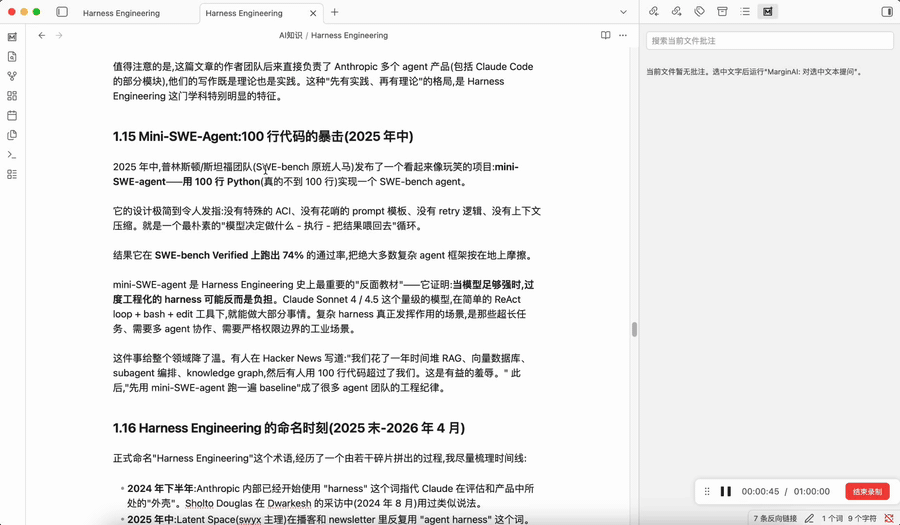

# MarginAI

[](#中文)
[](#english)



## 中文

MarginAI 是一个面向 Obsidian 的 AI 辅助阅读批注插件。它不是“和整篇文档聊天”的工具，而是把 AI 回答绑定到你正在阅读的原文片段旁边，让问题、原文和理解过程保留在同一个阅读上下文里。

### 它解决什么问题

阅读长文、论文、访谈和技术文档时，很多问题都来自某一小段原文。MarginAI 的目标是让你：

- 选中 Markdown 笔记中的一段原文；
- 针对这段原文提问或写下自己的批注；
- 在侧边栏中看到和当前文件相关的批注卡片；
- 点击批注快速定位回原文；
- 需要时把批注保存为独立 Markdown 笔记，并和原文建立链接。

### 当前功能

- 文件级批注侧边栏：只显示当前 Markdown 文件的批注。
- AI 批注：选中文本后提问，使用 OpenAI-compatible API 生成回答。
- 个人批注：不调用 AI，直接保存自己的阅读笔记。
- 原文定位：批注卡片可以跳回对应原文位置。
- 卡片展开/收起：长回答默认折叠，按原文顺序排列。
- 批注编辑：直接修改已生成的回答正文。
- 保存为笔记：把批注生成到 vault 内的 Markdown 文件。
- 回答 Skills：内置 JSON skill 可检查、可覆盖，用于控制不同问题类型的回答策略。
- 可选联网搜索：概念解释/延伸讨论可通过 Tavily 或自定义搜索接口补充外部资料。

### 安装和本地测试

当前项目还处于早期开发阶段，暂未发布到 Obsidian 社区插件市场。可以手动安装：

```bash
cd plugin
npm install
npm run build
```

然后把以下文件复制到你的 Obsidian vault：

```text
.obsidian/plugins/margin-ai/
  manifest.json
  main.js
  styles.css
  skills/
```

重启 Obsidian，或在设置中重新加载插件。

### 配置

在 MarginAI 设置中配置：

- API Base URL：任何 OpenAI-compatible endpoint，例如 OpenAI、兼容层服务或本地模型网关。
- API Key：仅保存在本地 Obsidian 插件数据中。
- Model：你的目标模型名称。
- 自定义 Skills 文件夹：默认 `MarginAI/Skills`，可用来覆盖内置回答策略。
- 联网搜索：可选，默认支持 Tavily Search API，也支持自定义 URL 模板。

默认生成的批注笔记目录：

```text
MarginAI/Annotations
```

### 隐私和数据所有权

MarginAI 是 local-first 的 Obsidian 插件。批注数据保存在本地插件数据和你的 vault 中。插件不会提供托管后端；AI 请求只会发送到你自己配置的 API endpoint。

如果启用联网搜索，搜索关键词和请求会发送到你配置的搜索服务。

### 开源状态

这是一个早期项目。欢迎提交 issue、建议、回答 skill、UI 改进和代码贡献。当前重点是把“选中原文 -> 提问/批注 -> 回到原文 -> 生成笔记”的核心阅读闭环做稳。

## English

MarginAI is an Obsidian plugin for AI-assisted reading annotations. It is not a generic "chat with document" tool: answers are attached to the exact source text you selected, so the question, quote, and interpretation stay close to the reading context.

### What It Does

When reading long essays, papers, interviews, or technical docs, questions often come from a specific passage. MarginAI helps you:

- select source text in a Markdown note;
- ask AI about that exact selection or write a personal annotation;
- manage annotations in a sidebar scoped to the current file;
- jump from an annotation back to the source text;
- optionally turn an annotation into a Markdown note in your vault.

### Current Features

- File-scoped annotation sidebar for the active Markdown file.
- AI annotations through an OpenAI-compatible API.
- Personal annotations without calling AI.
- Source navigation from cards back to the selected passage.
- Expand/collapse cards, sorted by source order.
- Editable annotation bodies.
- Markdown note generation inside the vault.
- Inspectable and overrideable JSON answer skills.
- Optional web search enrichment through Tavily or a custom URL-template provider.

### Installation and Local Testing

MarginAI is still early and is not yet published to the Obsidian community plugin directory. To install manually:

```bash
cd plugin
npm install
npm run build
```

Copy these files into your Obsidian vault:

```text
.obsidian/plugins/margin-ai/
  manifest.json
  main.js
  styles.css
  skills/
```

Restart Obsidian or reload the plugin from settings.

### Configuration

Configure MarginAI from the plugin settings:

- API Base URL: any OpenAI-compatible endpoint, including OpenAI, compatibility gateways, or local model gateways.
- API Key: stored only in local Obsidian plugin data.
- Model: the model name to call.
- Custom Skills Folder: defaults to `MarginAI/Skills` for overriding built-in answer strategies.
- Web Search: optional. Tavily is supported by default; custom URL templates are available for advanced users.

Default generated annotation note folder:

```text
MarginAI/Annotations
```

### Privacy and Data Ownership

MarginAI is a local-first Obsidian plugin. Annotation data is stored in local plugin data and your vault. The plugin does not provide a hosted backend; AI requests are sent only to the API endpoint you configure.

If web search is enabled, search queries and requests are sent to your configured search provider.

### Open Source Status

This is an early-stage project. Issues, product feedback, answer skills, UI improvements, and code contributions are welcome. The current priority is making the core reading loop reliable: select source text, ask or annotate, revisit the source, and optionally generate a durable Markdown note.

## Development

The active Obsidian plugin project lives in [`plugin/`](plugin/).

```bash
cd plugin
npm install
npm run typecheck
npm run build
```

## License

MIT
